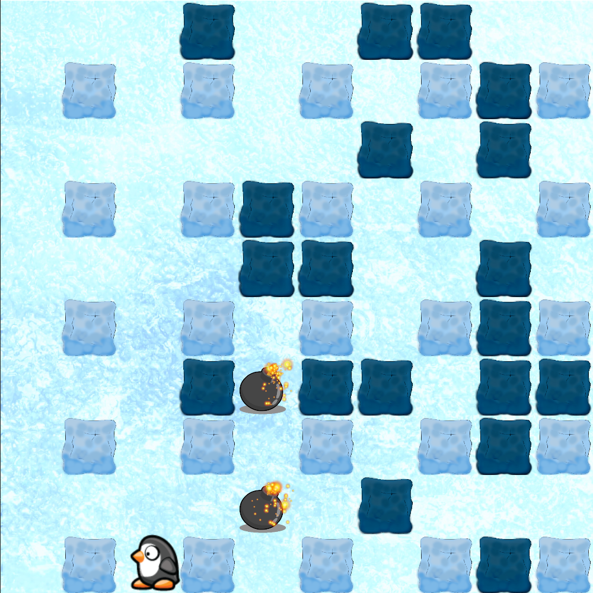

# SFMLGame
This project was undertaken during the study phase as a means to practice writing C++ code, learn SFML, and commit code daily. The game itself is a recreation of the popular flash game "Penguin Bomberman".

  
  

You can move around a cute penguin by using arrow keys and place bombs by using spacebar. Bombs can be moved, detonated and connect to other bombs and dark blue squares can be destroyed.

## Running the game
To run the game, simply open the Game.sln file in Visual Studio. Then, make sure to set the version to x86 to run the game.

## Lessons
At the time of writing this code, I was not yet familiar with design patterns. This project serves as a good illustration of their importance. The current code structure makes it challenging to incorporate features like additional players, networking, and general algorithms.

Moreover, there are still several bugs present in the game. Many of these issues arise from over-complicating simple problems.
